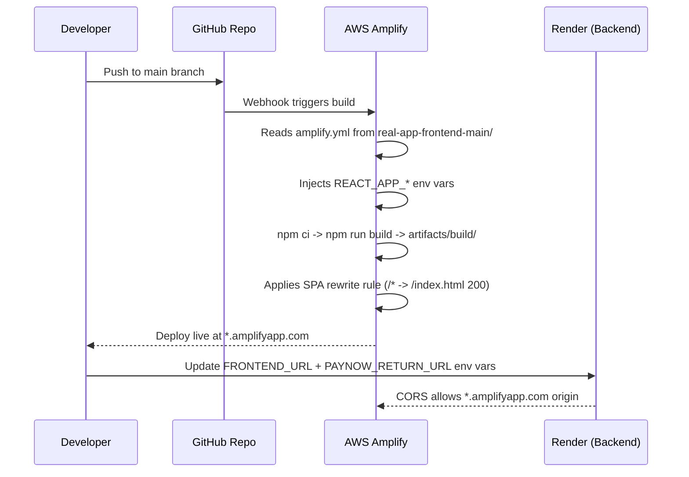

# Creapy
## Deployment

1. Connect the `real-app-frontend-main` subdirectory to AWS Amplify. In Amplify monorepo settings, set **App root** to `real-app-frontend-main`.
2. Add all required environment variables in Amplify from `real-app-frontend-main/AMPLIFY_ENV.md`.
3. Amplify reads `real-app-frontend-main/amplify.yml`; confirm the build output directory is `build`.
4. Keep the backend on Render and set `FRONTEND_URL` on Render to the deployed Amplify URL after first frontend deploy.
5. Set `PAYNOW_RETURN_URL` on Render to the deployed Amplify frontend URL.

## Documentation

The canonical documentation set now lives under [docs/INDEX.md](docs/INDEX.md) with the main reference, operations, legal, and client-handover sections.

- [docs/INDEX.md](docs/INDEX.md) - entry point for the documentation hierarchy
- [docs/reference/architecture.md](docs/reference/architecture.md) - architecture reference
- [docs/reference/api.md](docs/reference/api.md) - API reference
- [docs/reference/database.md](docs/reference/database.md) - database reference
- [docs/client-handover/README.md](docs/client-handover/README.md) - client-facing handover pack
- [docs/guides/END_USER_GUIDE.md](docs/guides/END_USER_GUIDE.md) - end-user guide
- [docs/guides/LANDLORD_GUIDE.md](docs/guides/LANDLORD_GUIDE.md) - landlord guide
- [docs/guides/ADMIN_GUIDE.md](docs/guides/ADMIN_GUIDE.md) - administrator guide

## E2E Testing

Creapy includes a full automated E2E test suite and manual QA checklists.

- [docs/guides/END_USER_GUIDE.md](docs/guides/END_USER_GUIDE.md) - end-user guide for tenants and landlords
- [docs/operations/SMOKE_TEST_PLAN.md](docs/operations/SMOKE_TEST_PLAN.md) - launch-day smoke testing plan
- [real-app-backend-main/README.md](real-app-backend-main/README.md) - automated E2E test run command (`PAYMENT_PROVIDER=mock npm run test:e2e`)
